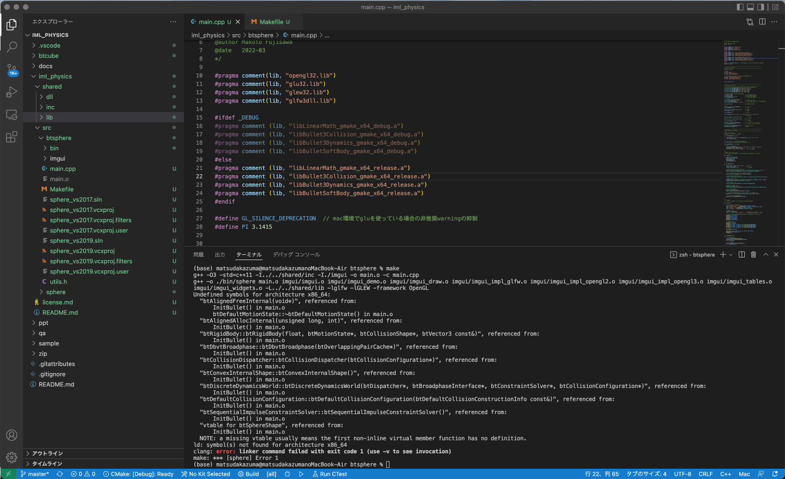
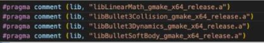
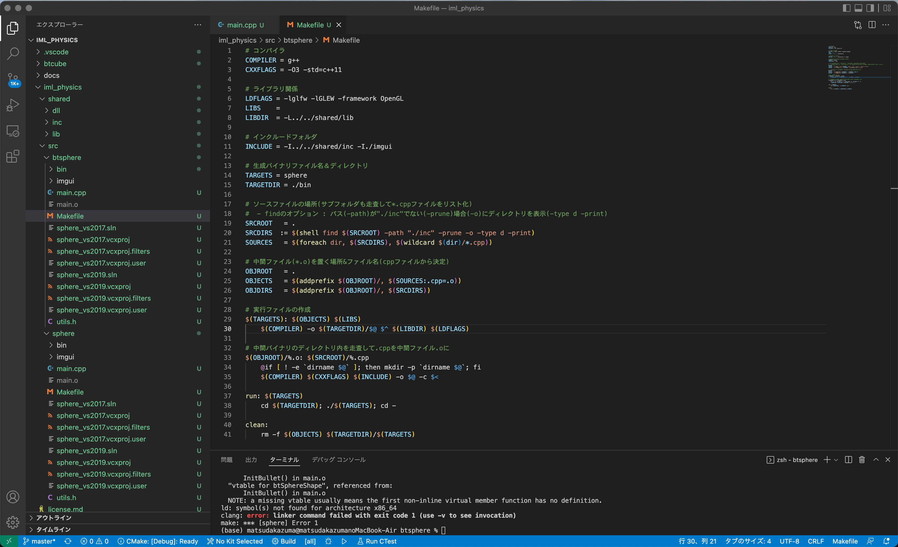
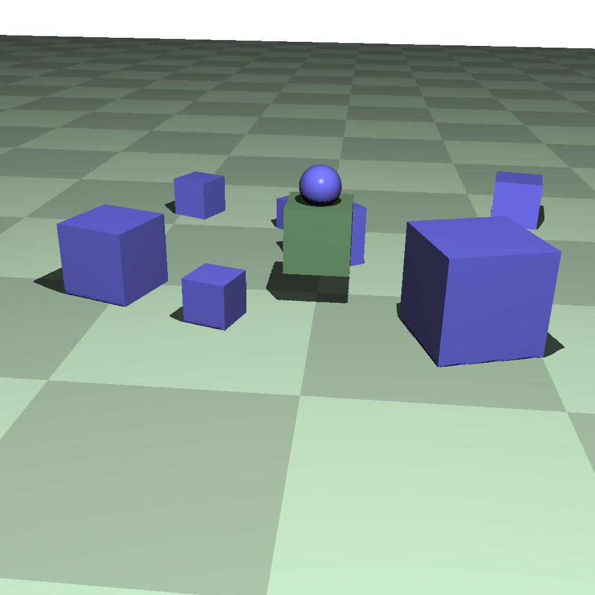
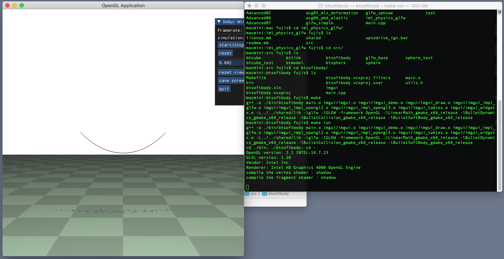

- [過去の質問(2022年度)](#過去の質問2022年度)
    - [エラー (アクティブ) E1696 ソース ファイルを開けません "btBulletDynamicsCommon.h"](#エラー-アクティブ-e1696-ソース-ファイルを開けません-btbulletdynamicscommonh)
    - [mac環境で、ld: symbol(s) not found for architecture x86_64clang: error: linker command failed with exit code 1 (use -v to see invocation)と言うエラーで動かない](#mac環境で、ld-symbols-not-found-for-architecture-x86_64clang-error-linker-command-failed-with-exit-code-1-use--v-to-see-invocationと言うエラーで動かない)
    - [練習問題3でボールが跳ねた際に速度のx成分が失われてしまう](#練習問題3でボールが跳ねた際に速度のx成分が失われてしまう)
    - [「物体が落下する途中に固定された立方体を追加」について](#「物体が落下する途中に固定された立方体を追加」について)
    - [eye_pos等をglm::vec3で定義してCalLocalPosに渡すとアクセス違反と言われる](#eye_pos等をglmvec3で定義してcallocalposに渡すとアクセス違反と言われる)
    - [kinematic body をdynamic body に変換する方法について](#kinematic-body-をdynamic-body-に変換する方法について)
    - [Contraintでくっつけた物体を離そうとするとエラーが出る](#contraintでくっつけた物体を離そうとするとエラーが出る)
    - [Mac環境でbtSoftBodyがうまく動かない(clangの問題)](#mac環境でbtsoftbodyがうまく動かないclangの問題)
    - [弾性体の練習1で「例外がスローされました」というエラーが出る](#弾性体の練習1で「例外がスローされました」というエラーが出る)
    - [LNK2005 ～は既に libcpmt.lib(cout.obj) で定義されています。 やLNK2038'RuntimeLibrary' の不一致が検出されました。というエラーがでる](#lnk2005-～は既に-libcpmtlibcoutobj-で定義されています。-やlnk2038runtimelibrary-の不一致が検出されました。というエラーがでる)
    - [objファイルを取り込もうとすると大きさがおかしい](#objファイルを取り込もうとすると大きさがおかしい)


## エラー (アクティブ) E1696 ソース ファイルを開けません "btBulletDynamicsCommon.h"
一番最初の方で以下のエラーでつまっているのですがこれはどうしたら良いですか？ソリューションエクスプローラの方に以下のヘッダーファイルがないということでしょうか？

エラー (アクティブ)    E1696    ソース ファイルを開けません "btBulletDynamicsCommon.h"    sphere    

<dl>
	<dt>[2022/05/16 10:22] TA</dt>
	<dd>
考えられる原因は以下の通りだと思います
プロジェクトファイルsphere_vs2019.vcxprojから見て../../shared/incにbtBulletDynamicsCommon.hがない or そもそも../../shared/incが存在しない(小比賀さんの場合../../sharedはC:\Users\小比賀　仁\情報メディア実験A\iml_physics\shared\inc ?)
プロジェクトのプロパティ->構成プロパティ->C/C++->全般->追加のインクルードディレクトリに../../shared/incが存在しない
LinearMath/btQuaternion.hがインクルードできているので下の可能性は低そうですが...
	</dd>
</dl>
<dl>
	<dt>[2022/05/16 10:42] 質問者</dt>
	<dd>
../../shared/incにbtBulletDynamicsCommon.hがないように思えるのですがこの場合はどうすれば良いのでしょうか。
​	</dd>
</dl>
<dl>
	<dt>[2022/05/16 10:46] TA</dt>
	<dd>
初期状態ではbulletライブラリは入ってないので，説明ページの冒頭を参考にしながら自分でビルドして出力されたヘッダとバイナリ(*.lib)を適切な場所にコピーしてください
​	</dd>
</dl>
<dl>
	<dt>[2022/05/16 11:16] 質問者</dt>
	<dd>
エラーがなくなりました。ありがとうございます。説明部分をMacの説明だと思って読み飛ばしていました。
	</dd>
</dl>


## mac環境で、ld: symbol(s) not found for architecture x86_64clang: error: linker command failed with exit code 1 (use -v to see invocation)と言うエラーで動かない
mac環境で、ld: symbol(s) not found for architecture x86_64clang: error: linker command failed with exit code 1 (use -v to see invocation)と言うエラーで動かなくなってしまいました。bulletのライブラリに含まれるものが認識されなくなっているようなのですが、どうしたら良いでしょうか？


​
<dl>
	<dt>[2022/05/18 13:40] TA</dt>
	<dd>
../../shared/libに以下のバイナリありますか？


​	</dd>
</dl>
<dl>
	<dt>[2022/05/18 13:41] 質問者</dt>
	<dd>
あります。
​	</dd>
</dl>
<dl>
	<dt>[2022/05/18 13:46] TA</dt>
	<dd>
Makefileどんな感じですか？
​	</dd>
</dl>
<dl>
	<dt>[2022/05/18 13:49] 質問者</dt>
	<dd>
いろいろ入れ直したので初期状態に戻ってると思います…


​	</dd>
</dl>
<dl>
	<dt>[2022/05/18 13:49] TA</dt>
	<dd>
LDFLAGS = -lglfw -lGLEW -framework OpenGL -lLinearMath_gmake_x64_release -lBulletDynamics_gmake_x64_release -lBulletCollision_gmake_x64_release -lBulletSoftBody_gmake_x64_release

LDFLAG更新して再度ビルドしてみてください
​	</dd>
</dl>
<dl>
	<dt>[2022/05/18 13:50] 藤澤誠</dt>
	<dd>
libの指定が，libBullet3Dynamics*, libBullet3Collision*となっているところが間違い？"3"を消してみてください．
	</dd>
</dl>
<dl>
	<dt>[2022/05/18 13:52] 質問者</dt>
	<dd>
LDFLAGの更新で通りました、ありがとうございました！
	</dd>
</dl>


## 練習問題3でボールが跳ねた際に速度のx成分が失われてしまう
前回の練習問題の3なのですが、ボールが跳ねた際に速度のx成分が失われてしまいます。どこがダメなのでしょうか？

<dl>
	<dt>[2022/05/20 18:15] 藤澤誠</dt>
	<dd>
156-158行目で慣性テンソルを計算していますが，157行目でsphere_shape用に計算した結果を格納したinertiaを158行目のbox_shape用の計算で上書きしてしまっていて，box_shapeの方は床なので質量0として計算されているので，g_ballbodyの方も全く回転しない状態になっているのが原因のようです．変数inertiaを名前を変えてもう一つ作って，格納する変数を分けるようにしましょう．
	</dd>
</dl>


## 「物体が落下する途中に固定された立方体を追加」について
「物体が落下する途中に固定された立方体を追加」というのは、直前に生成したオブジェクトの位置に固定された立方体を作ると言う理解でいいですか？
​
<dl>
	<dt>[2022/05/27 17:24] 藤澤誠</dt>
	<dd>
直前に生成したオブジェクトの位置というより，落下途中の位置に固定物体があるというイメージです(下図の緑の立方体)．


​	</dd>
</dl>
<dl>
	<dt>[2022/05/27 17:24] 藤澤誠</dt>
	<dd>
ちなみに，どの位置に固定物体を置くかは自由です．
​	</dd>
</dl>
<dl>
	<dt>[2022/05/27 17:26] 質問者</dt>
	<dd>
ランダムな位置で固定物体を作ると言うことでいいんですね？
​	</dd>
</dl>
<dl>
	<dt>[2022/05/27 17:27] 藤澤誠</dt>
	<dd>
はいそうです．「物体が落下する途中に固定された立方体を追加」というのは位置でなく，発生タイミングのことを言っています．
​	</dd>
</dl>
<dl>
	<dt>[2022/05/27 17:27] 質問者</dt>
	<dd>
ありがとうございます。
​	</dd>
</dl>
<dl>
	<dt>[2022/05/27 17:29] 藤澤誠</dt>
	<dd>
すいません，発生タイミングと言ってしまいましたが改めて文章を見ると位置の話のようですね... 動く物体を発生させているのでそれと当たらないと固定されているか分からないので，落下する途中に置くと書いたようです．どちらで捉えてもOKです．
​	</dd>
</dl>
<dl>
	<dt>[2022/05/27 17:50] 質問者</dt>
	<dd>
わかりました。直前の物体の位置はどのように参照したらよいでしょうか…？
​	</dd>
</dl>
<dl>
	<dt>[2022/05/27 17:56] 藤澤誠</dt>
	<dd>
直前に追加した物体の位置に基づいて位置を決める必要はないです．
一応方法としては，

btRigidBody* body = SetCube(...)

とかでキーボード関数内で剛体を定義していたとして，その情報を格納するグローバル変数を用意(btRigidBody *g_prev_body = 0;とか)して，定義後に，g_prev_body = body; と直前の追加交代の情報を保存しておきます．後は，前のところで剛体を描画するときに位置を取得していたと思いますがそれと同じ方法を使えば位置が得られます．

btVector3 pos = g_prev_body->getCenterOfMassPosition();
​	</dd>
</dl>
<dl>
	<dt>[2022/05/27 18:01] 質問者</dt>
	<dd>
ありがとうございます。
	</dd>
</dl>


## eye_pos等をglm::vec3で定義してCalLocalPosに渡すとアクセス違反と言われる
練習問題8でつまっています。授業資料でeye_pos等の配列をdouble型にしていますがCalLocalPosに渡すとエラーが出て，そこで配列をglm::vec3で定義したところうまくはいったのですがデバッグしている時にアクセス違反がでてしまい困っています。どうすればよいでしょうか？

<dl>
	<dt>[2022/06/01 14:34] TA</dt>
	<dd>
例外発生時の呼び出し履歴のスクショだせますか？
​	</dd>
</dl>
<dl>
	<dt>[2022/06/01 14:41] 質問者</dt>
	<dd>
これですか？

.png)
​	</dd>
</dl>
<dl>
	<dt>[2022/06/01 14:42] TA</dt>
	<dd>
それですありがとうございます！

Timer関数内の706行目って今回の問題と関連ありますか？

3枚目の画像から見ると恐らくbtVector3同士の積算でv2の中の値が不定になっているようです
なので，一回eye_pos1,eye_dir1の中身を確認してもいいかもしれません
​	</dd>
</dl>
<dl>
	<dt>[2022/06/01 14:52] 質問者</dt>
	<dd>
timer関数内で外力を視線方向に与えています(つもりです)。
​	</dd>
</dl>
<dl>
	<dt>[2022/06/01 14:57] TA</dt>
	<dd>
btRigidBody.hの321行目が以下の通りなんで，質量を設定していない可能性がありそうです
もくしはm_linearFactorを設定する必要があるかも

```
m_linearVelocity += impulse * m_linearFactor * m_inverseMass;
```

CreateRigidBodyで質量は設定していそうですね...
​	</dd>
</dl>
<dl>
	<dt>[2022/06/01 15:25] TA</dt>
	<dd>
main.cpp 706行目Timer関数内でNULLのg_throwbodyにアクセスしているためアクセス違反が発生していました
	</dd>
</dl>


## kinematic body をdynamic body に変換する方法について
前回の練習４でkinematic body をdynamic body に変換する方法がわからず、元のbodyを削除して新たに生成する方法をとったのですが、変換する方法はありますか？
​
<dl>
	<dt>[2022/06/03 16:36] TA</dt>
	<dd>
CollisionFlagsの更新と質量の設定(kinematic bodyは質量0)を行えばできると思います
​	</dd>
</dl>
<dl>
	<dt>[2022/06/03 16:38] 藤澤誠</dt>
	<dd>
setCollisionFlags関数でCF_KINEMATIC_OBJECT か CF_DYNAMIC_OBJECT を引数として指定することでBullet内での扱いは変えれます．後はTA鈴木君が言ったように質量の再設定を行えばOKです．
​	</dd>
</dl>
<dl>
	<dt>[2022/06/03 16:40] 質問者</dt>
	<dd>
ありがとうございます。質量の再設定はsetMassPropsを使えば良いでしょうか？
​	</dd>
</dl>
<dl>
	<dt>[2022/06/03 16:45] TA</dt>
	<dd>
はい
ただ，setMassPropsにはinertiaも必要なのでcalculateLocalInertiaでinertiaを得る必要があります
​	</dd>
</dl>
<dl>
	<dt>[2022/06/03 16:55] 質問者</dt>
	<dd>
記述を変えてみましたが、物体の色が変わるだけで、他の物体がすり抜けてしまいます。
衝突判定がおかしいのでしょうか？
​	</dd>
</dl>
<dl>
	<dt>[2022/06/03 16:57] 藤澤誠</dt>
	<dd>
こちらで試してみたのですが，flag変更とmasspropsの変更だけだと，dynamic bodyにはなるのですが，動かないようです．元のオブジェクトの情報を取得して，同じ位置にaddする必要がありそうです．

```
if(g_movebody){​​​​​​​
g_dynamicsworld->removeCollisionObject(g_movebody);
int flags = g_movebody->getCollisionFlags();
flags ^= btCollisionObject::CF_KINEMATIC_OBJECT;
flags ^= btCollisionObject::CF_STATIC_OBJECT;
g_movebody->setCollisionFlags(flags);
btScalar mass = 1.0;
btVector3 inertia;
g_movebody->getCollisionShape()->calculateLocalInertia(mass, inertia);
g_movebody->setMassProps(mass, inertia);
g_movebody->setActivationState(DISABLE_DEACTIVATION);
g_dynamicsworld->addRigidBody(g_movebody);
}​​​​​​​
```

こんな感じでやるとこちらでは上手くいきました．
​	</dd>
</dl>
<dl>
	<dt>[2022/06/03 17:02] 質問者</dt>
	<dd>
ありがとうございます。こちらでも動きました。
	</dd>
</dl>


## Contraintでくっつけた物体を離そうとするとエラーが出る
```
if (g_constraint) {​​​​​​​
btJointFeedback* f = g_constraint->getJointFeedback();
// Constraintを構成する2つのオブジェクトにそれぞれConstraintから働いている力を取得する
btVector3 force1 = f->m_appliedForceBodyA;
btVector3 force2 = f->m_appliedForceBodyB;
// 所得した力はベクトルなので，ベクトルの大きさ(norm)を基準に接続を切るかどうかを判定
if (force1.norm() > 1000.0 || force2.norm() > 1000.0) {​​​​​​​
// ここにConstraintを削除する処理を記述
//g_dynamicsworld->removeConstraint(g_constraint);
//delete g_constraint;
for (int i = g_dynamicsworld->getNumConstraints()-1 ; i >= 0;i--) {​​​​​​​
btTypedConstraint* constraint = g_dynamicsworld->getConstraint(i);
g_dynamicsworld->removeConstraint(constraint);
delete constraint;
}​​​​​​​
g_constraint = 0;
}​​​​​​​
}​​
```
​​​​​
for文をコメントアウトしてその上の2つのコメントを外すとうまくいきますが上のプログラムだと物体同士が離れた瞬間にエラーが出て調べるとm_sizeのところのメモリが読み取れないことがわかったのですがなぜ上のプログラムだとだめなのかわからないです。

<dl>
	<dt>[2022/06/10 16:27] 藤澤誠</dt>
	<dd>
こちらでも試してみました．確かにエラーが出ます．for文の方はシーン中のすべてのconstraintを削除しているのですが，実はマウスで物体をつかむところでもconstraintを使っています．そのため，

1. for文内で全てのconstraintが削除される(この時点ではまだマウスドラッグ中)

2. マウスのボタンを放す

3. Mouse関数が呼ばれて，その中の else if(action == GLFW_RELEASE){​​​​​​​ のところが実行される

4. g_pickconstraintというマウスピック用のconstraintを削除しようとする → 1で全てのconstraintが削除されているのに更に削除しようとしてエラーが出る　といったところではないかと．

​	</dd>
</dl>
<dl>
	<dt>[2022/06/10 16:28] 藤澤誠</dt>
	<dd>
↑物体が離れたときではなく，マウスボタンを離したときにエラーで落ちたら確実です．
​	</dd>
</dl>
<dl>
	<dt>[2022/06/10 16:32] 質問者</dt>
	<dd>
確かにマウスボタンを離したらエラーがでました。原因がわかりました。ありがとうございます。
	</dd>
</dl>


## Mac環境でbtSoftBodyがうまく動かない(clangの問題)
[btSoftBodyがmac環境でうまく動かないとの質問を授業中に受けての回答]

先ほどのbtSoftBodyに関してですが，下記画像のようにこちらの環境だと特に問題なさそうです．ただ，こちらの環境(2012のmac mini, macOS Catalina)が古いというのもあるので，直らないようならばエラーメッセージなど送ってください．


​
コード(main.cpp)とmakefileを一度送ってみてくれませんか．こちらの環境で試してみます．
​	</dd>
</dl>
<dl>
	<dt>[2022/06/17 17:15] 質問者</dt>
	<dd>
こちらでお願いします(additional functionsは自分用の便利関数を記述したものです)
	</dd>
</dl>
<dl>
	<dt>[2022/06/17 17:26] 藤澤誠</dt>
	<dd>
エラー内容をここに貼ることはできますか？笹栗君のコードをこちらのmac上でビルドしたら問題なく通ってしまって，実行できてしまいました...
	</dd>
</dl>
<dl>
	<dt>[2022/06/17 17:33] 質問者</dt>
	<dd>
こちらのようなエラーが出ています


​	</dd>
</dl>
<dl>
	<dt>[2022/06/17 17:48] TA</dt>
	<dd>
ちょっと調べてみたんですが，コンパイラのバグみたいな情報がちらほらあるのでコンパイラのバージョン調べられますか？

```
g++ --version
```

で確認できると思います
​	</dd>
</dl>
<dl>
	<dt>[2022/06/17 17:50] 質問者</dt>
	<dd>
g++ (Homebrew GCC 11.3.0_1) 11.3.0
です
​	</dd>
</dl>
<dl>
	<dt>[2022/06/17 17:50] 藤澤誠</dt>
	<dd>
その可能性もあるかな．こちらの環境では 12.0.0 ですね．
​	</dd>
</dl>
<dl>
	<dt>[2022/06/17 17:52] TA</dt>
	<dd>
だめもとでバージョン上げてみるのもいいかもしれません
​	</dd>
</dl>
<dl>
	<dt>[2022/06/17 17:54] 質問者</dt>
	<dd>
先生の環境でのコンパイラもgccでしょうか？macはデフォルトだとclangになってたと思うので
​	</dd>
</dl>
<dl>
	<dt>[2022/06/17 17:56] 藤澤誠</dt>
	<dd>
私の環境はclangですね．clang version 12.0.0 (clang-1200.0.32.29)です．brewでgccをインストールしてみて試してみます．
​	</dd>
</dl>
<dl>
	<dt>[2022/06/17 18:01] 質問者</dt>
	<dd>
Apple clang version 13.1.6 (clang-1316.0.21.2.5) で実行してみたのですが、同様のエラーが出てきます
	</dd>
</dl>
<dl>
	<dt>[2022/06/22 13:04] 質問者</dt>
	<dd>
前回先生からいただいたtest_softbodyでビルドしてみようとしましたが同様のエラーが出ている状態です
	</dd>
</dl>
<dl>
	<dt>[2022/06/22 13:07] 藤澤誠</dt>
	<dd>
うーん，こちらでもコンパイラなどの環境を変えて試してみます(こちらでの状況の再現性がないと原因特定が難しい)ので，そちらでも試行錯誤してみてください．
​	</dd>
</dl>
<dl>
	<dt>[2022/06/22 13:11] 質問者</dt>
	<dd>
承知いたしました。言い忘れたのですがclangもgccも同じエラーが出ています。引き続きこちらも原因探します
	</dd>
</dl>
<dl>
	<dt>[2022/06/22 13:33] 藤澤誠</dt>
	<dd>
エラーをもう一度チェックすると，basic_stringとかistreamとかの標準ライブラリ関係のリンカエラーのようですので，

https://stackoverflow.com/questions/16352833/linking-with-clang-on-os-x-generates-lots-of-symbol-not-found-errors

にあるようにリンク時のオプションに -stdlib=libc++ -sharedあたりを追加してみてくれませんか？Makefileだと6行目のLDFLAGSに追加すればOKです．
	</dd>
</dl>
<dl>
	<dt>[2022/06/22 13:33] 質問者</dt>
	<dd>
clang++を使用したらビルド通りました
​	</dd>
</dl>
<dl>
	<dt>[2022/06/22 13:34] 藤澤誠</dt>
	<dd>
入れ違いになりましたがビルド通って良かったです！おそらくc++の標準ライブラリが上手くリンクされていなかったようですね．clang++だとデフォでリンクしてくれて特にオプション指定いらないのかもしれません．
​	</dd>
</dl>
<dl>
	<dt>[2022/06/22 13:39] 質問者</dt>
	<dd>
対応いただきありがとうございました
​	</dd>
</dl>
<dl>
	<dt>[2022/06/22 13:39] 藤澤誠</dt>
	<dd>
追記: clangで試してみたら同様のエラーが再現できました．clangだと-stdlib=libc++としてもダメっぽいですね．clang++を明示的に指定するのが正解のようです．
	</dd>
</dl>


## 弾性体の練習1で「例外がスローされました」というエラーが出る
弾性体の練習1で以下のエラーがでるのですがどうすれば良いでしょうか。Hキーでロープを生成する関数softropeを呼び出していますがHを押すとエラーが出ます。

.png)

<dl>
	<dt>[2022/06/24 18:02] 藤澤誠</dt>
	<dd>
現バージョンのBulletだとbtSoftBodyをDebugモードで使おうとするとAssertでプログラムが止まってしまうようです．Releaseモードに切り替えてビルドするようにしてください．Releaseモードへの切り替え方含めて，実験説明ページ(弾性体のところ)に注意事項として説明を追加しておきましたので，そちらも参考にしてください．
	</dd>
</dl>


## LNK2005 ～は既に libcpmt.lib(cout.obj) で定義されています。 やLNK2038'RuntimeLibrary' の不一致が検出されました。というエラーがでる
```
エラー    LNK2005    "protected: char * __cdecl std::basic_streambuf<char,struct std::char_traits<char> >::eback(void)const " (?eback@?$basic_streambuf@DU?$char_traits@D@std@@@std@@IEBAPEADXZ) は既に libcpmt.lib(cout.obj) で定義されています。    
エラー    LNK2038    'RuntimeLibrary' の不一致が検出されました。値 'MDd_DynamicDebug' が MT_StaticRelease の値 'main.obj' と一致しません。
```
というエラーが何個も出てくるのですがどうすれば良いですか？必要なrelease.libはshared/libに入っています。
​
<dl>
	<dt>[2022/06/29 12:39] TA</dt>
	<dd>
プロジェクトのプロパティ開いて，構成プロパティ->C/C++->コード生成のランタイムライブラリって現状何になってますか？
​	</dd>
</dl>
<dl>
	<dt>[2022/06/29 12:41] 質問者</dt>
	<dd>
マルチスレッド(/MT)になってます。さっきそこをいじったのですがいじる前からエラーが出ている感じです。
​	</dd>
</dl>
<dl>
	<dt>[2022/06/29 12:42] TA</dt>
	<dd>
/MDは試しました？
​	</dd>
</dl>
<dl>
	<dt>[2022/06/29 12:54] 藤澤誠</dt>
	<dd>
エラーメッセージで"値 'MDd_DynamicDebug' が MT_StaticRelease の値 'main.obj' と一致しません"とあるので，自分のプロジェクトの方はReleaseなのに，Debugモードのlibファイル(*_debug.lib)をリンクしているようですね．Releaseモードで作成したlibファイル(*_release.lib)をリンクするようにしましょう．

あと，ランタイムライブラリについては，Bulletのデフォが”マルチスレッド DLL (/MD)”だったのでそれに合わせています．もしその設定も変えていたら"マルチスレッド DLL (/MD)"に変更するようにしてください．
​	</dd>
</dl>
<dl>
	<dt>[2022/06/29 13:01] 質問者</dt>
	<dd>
プロパティ->リンカ->入力のところでdebugとreleaseの両方を書いていたのでdebugの方を消してあと，/MDの方に変更するとうまくいきました！ありがとうございます。
	</dd>
</dl>


## objファイルを取り込もうとすると大きさがおかしい
objファイルを取り込もうとすると大きさがおかしくなるのですがどうすればよいでしょうか。スケール変更とかはできますか?

<dl>
	<dt>[2022/07/22 17:10] TA</dt>
	<dd>
blenderでimportしてスケール変更してから再度objにexportするのが一番楽だと思います
​	</dd>
</dl>
<dl>
	<dt>[2022/07/22 17:12] 質問者</dt>
	<dd>
わかりました。試してみます。
​	</dd>
</dl>
<dl>
	<dt>[2022/07/22 17:42] 質問者</dt>
	<dd>
サイズ変更することができました，ありがとうございます!
	</dd>
</dl>
